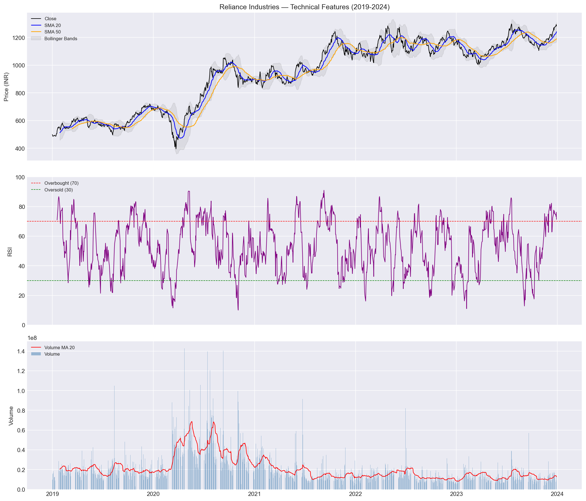
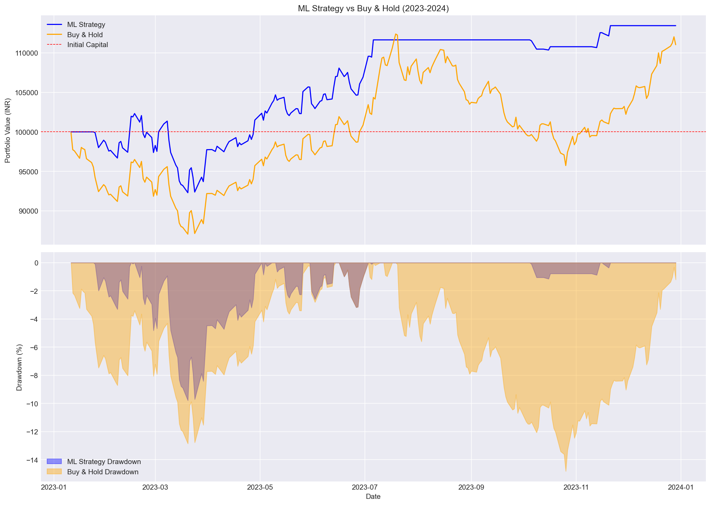
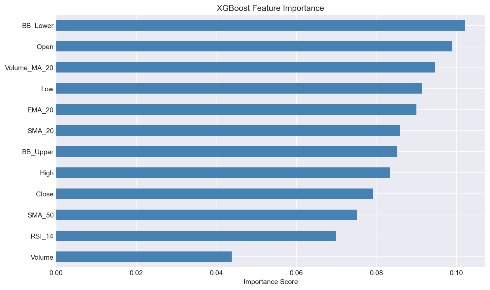
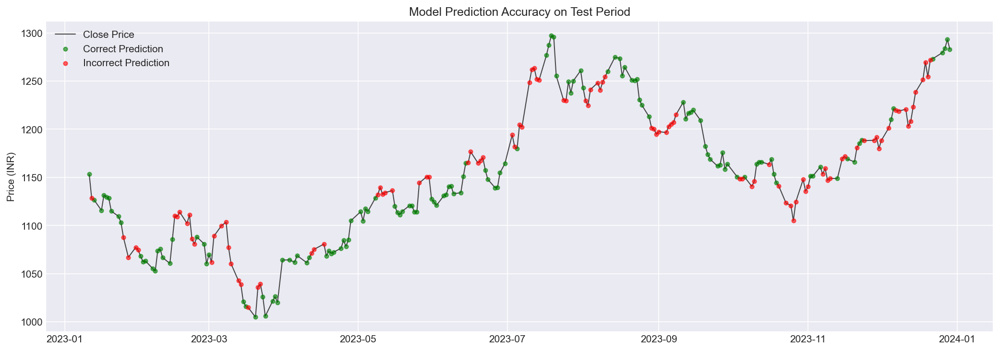

# ML-Based Stock Market Backtesting Engine

A machine learning pipeline that predicts short-term price direction 
for NSE stocks and backtests trading signals against a buy-and-hold benchmark.

## Results

| Metric | ML Strategy | Buy & Hold |
|--------|------------|------------|
| Total Return | 13.44% | 11.03% |
| Sharpe Ratio | 1.12 | 0.74 |
| Max Drawdown | -9.79% | -14.82% |

*Test period: January 2023 — December 2023 (out-of-sample)*

## Project Overview

This project explores whether ML-based trading signals can outperform a passive buy-and-hold strategy on NSE stocks. Built as a learning exercise in quantitative finance, the pipeline covers data collection, feature engineering, model training, and a custom backtesting engine with realistic transaction costs.

## Methodology

### Data
In this project I have taken last 5 years of data from yahoo finanace of "Reliance". In this first I cleaned the data to remove any rows with NA entry in any coloumn to have a consistent data. I specifically dropped the first 49 rows due to SMA_50 warmup period, and the last 5 rows due to target label creation. Then we split the data into 2 parts, first 4 years were used to train the ML model, and then it was tested on the data of the 5th year. 

### Feature Engineering

SMA_20 (Simple moving average for 20 days):
I created this feature to get a idea about how the market is in respect to the past 20 days. Here we take running average of Close prices of past 20 days.

SMA_50 (Simple moving average for 50 days):
This is same as SMA_20 but here we just take into account 50 days not 20. This help us give a broader and bigger picture of the stocks performance in the long term.

EMA_20 (Exponential moving average): 
The problem with SMA_20 is that it gives equal weightage to all the 20 days, but that might mislead us as I am far more concered with the t-1 day than the t-19 day, so EMA actually gives more weightage to recent days, giving us a better metric to study. 

                EMA(t)=α*Price(t) + (1-α)* EMA(t-1),      α=1/(span+1)

RSI (Relative Strength Index):
RSI measures momentum. This gives us an idea about if the stock is being overbought or oversold. RSI ranges between 0 and 100. 

                RSI=100*(RS)/(1+RS)       RS=Avg gain over N days/ Avg loss over N days

Generally a ceratin standard to understand RSI is that:
                RSI>70-> overbought
                RSI<30-> oversold
                RSI=50 neutral

It is important to note that RSI measure momentum not magnitude. A sharp 30% crash and a slow 10% grind can produce similar RSI readings. 

Bollinger Bands:
Middle Bollinger Band: This is simply same as SMA.
Lower Bollinger Band: This is SMA-2*standard deviations.
Upper Bollinger Bnad: This is SMA+2*standard deviations.

Why do we add Bollinger Bands? 
These bands expand when volatitlity is high and contract when low. Bollinger Bands are useful because they give you a quick visual measure of volatility and help identify when prices are unusually high or low relative to recent history.

Volume_MA (Volume Moving average):
Same as SMA but here instead of Close price we take the moving average of past 20 days Volume. This helps us understand the volatility of the stock. We can make a educated deduction if the stock is more volatile than it has been for the past 20 days or less.

Future_Close:
As this is a backtesting model and simulation. We add a new colume with Close prices shifted to the past by 5 days, for t will have the close price of t+5 in the "Future_Close" colume. This is done for the model to be able to train and test itself. It can learn something like if these were the condition on day t, then generally the price goes up/down after 5 days, over a good number of test cases model will train itself to recognize some patterns. However this feature will never be given to our model as it will learn to cheat then, we delete this column after calculating target feature. 

Target: 
This might be the most important feature of my data table. So bascially if Future_Close> Close then we set target as 1, to tell model you should have bought here.

### Model

We split our data into X and Y, X will be our input and Y will be our target. 
X contains all the feature columns except the target(1/0) column. Y only conatins this target column.
These X and Y are then further divided into X_test, X_train, Y_test, Y_train.
We also fit and make the data uniform as some values like volume are in millions and some like price in thousands, it is better to generalize the data and make it all in the range of 0 to 1. We split the data chronologically and not randomly to avoid future look ahead bias in our model while training. 

Here we use XGBoost for our ML model. 
I chose XGBoost because this is a binary classification problem on small tabular data. Linear models can't capture non-linear relationships in financial data. Neural networks need more data than I had. Random Forest was a viable alternative but XGBoost's sequential boosting — where each tree corrects previous errors — typically outperforms on tabular datasets. I also valued the built-in feature importance which gave me genuine insight into which signals were predictive.

            model = XGBClassifier(
                n_estimators=100,
                max_depth=4,
                learning_rate=0.05,
                subsample=0.8,
                colsample_bytree=0.8,
                random_state=42,
                eval_metric="logloss"
            )

### Backtesting Engine
Backtesting simulates trades on historical data to evaluate whether a strategy is profitable, using known past prices as ground truth. In this project I built the backtesting engine from scratch without using any dedicated backtesting library — only standard Python and Pandas.
The engine operates on a simple signal-based logic: when the model's predicted probability exceeds a threshold of 0.5, all available capital is deployed into the stock. When probability falls below the threshold, all shares are sold. To simulate real world trading conditions, a transaction cost of 0.1% is applied on every buy and sell, deducted directly from the trade value.
Portfolio value is tracked daily as the sum of liquid cash and current stock value (shares held × closing price). While one of these is always zero in the current all-in/all-out strategy, this two-variable structure is intentionally designed to support future extensions like partial position sizing based on model confidence.
 

### Evaluation

Model accuracy of 56.7% may seem modest but accuracy alone is misleading in trading — a model that predicts UP every day achieves ~54% accuracy on this dataset but loses money to transaction costs. Sharpe ratio and drawdown are the meaningful evaluation metrics

We get our output for the 2 trading statergies we implemented, one the backtesting and the other buy and hold.
We compared their final returns, sharpe ratio and maximum drawdown.

Sharpe Ratio:
Sharpe ratio tells us the return per unit risk. 
Sharpe = (Mean Daily Return - Risk Free Rate) / Std of Daily Returns
We get a sharpe ratio of 1.12 for backtest and 0.74 for buy/hold, a higher sharpe is better as we are getting more returns per risk we take. 

Maximum Drawdown: 
This tells me the biggest mountain to valley dip I see in my portfolio, what is the biggest loss I see compared to my portfolio. 
Max Drawdown = (Trough Value - Peak Value) / Peak Value

We get a Max DD of 9.79% in backtest and 14.82% in buy/hold, A smaller magnitude drawdown indicates better capital preservation. A large drawdown suggests the strategy may expose investors to significant temporary losses.

Overall we see that our backtest beats simple buy/hold.

## Key Visualizations

## Limitations and Honest Assessment

These are some limitation to my project:
1) We are testing on only 1 year data, maybe we just got lucky and by luck our model performed good in that one year which we tested. 
2) When we calculate the target we take into account the Close price of the same day the target is for, but we get the Close only when the market is closed and we cannot make any more trades, so we receive the signal to buy/sell only after the market is closed. We assume that we make this trade on next days opening as soon as market opens.
3) We are currently dumping all our cash into stocks as soon as we see buy signal from the model, we are treating the probability of 0.52 same as 0.90, which is not optimal, we can add a ceratin proportionality conversion where we decide how much to invest based on the probability. 
4) We are only relying on one singular stock. Ideally we should have a broad portfolio investing in different sectors. 

## Tech Stack

- Python, Pandas, NumPy
- XGBoost, scikit-learn
- Matplotlib
- yfinance

## How to Run

1. Clone the repository
   git clone https://github.com/Adityat05/stock_backtester_XgBoost.git

2. Create and activate virtual environment
   python -m venv venv
   venv\Scripts\activate

3. Install dependencies
   pip install -r requirements.txt

4. Run notebooks in order
   notebooks/01_data_collection.ipynb
   notebooks/02_features.ipynb
   notebooks/03_model_start.ipynb
   notebooks/04_model_training.ipynb
   notebooks/05_backtest.ipynb
   notebooks/06_final_plots.ipynb